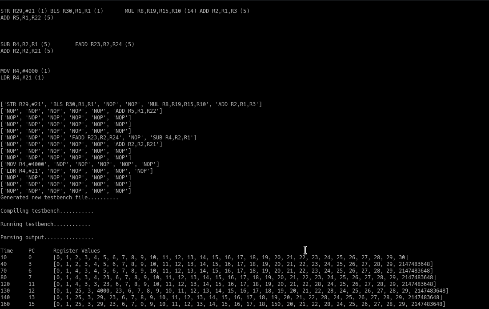

# VLIW-Processor
A simple VLIW processor with an integrated compiler written in Verilog and Python respectively

## test.vsm
This file is an input file with instructions in serial order

## Reorder.py
This is the main file to be run which reads test.vsm and reorders the instructions into packets such that maximum number of functional units are used at once, it also takes care of all hazards RAW,WAR,WAW.

## About The Processor
* 3 Stage pipeline
* 6 Instructions per cycle
* 6 Functional units (IntAdd,IntMul,FPAdd,FPMul,LogicUnit,MemoryUnit)
* All the units except Memory use register based addressing. Memory instructions use immediate operands only.
* No Jump/Branch instruction is supported 
* Memory has been split into Instruction memory (6kB) and Data memory (4Kb)

## Processor.v
The main verilog module which calls all the other units and contains memory units and registers. Reorder.py modifies this.

## Output Image


## Output Explaination

### The input file looks like:

```
ADD R2,R1,R3
SUB R4,R2,R1
MUL R8,R19,R15,R10
MOV R4,#4000
FADD R23,R2,R24
ADD R2,R2,R21
ADD R5,R1,R22
STR R29,#21
LDR R4,#21
BLS R30,R1,R1
```
### The packetized ed output is

```
STR R29,#21 (1) BLS R30,R1,R1 (1)       MUL R8,R19,R15,R10 (14) ADD R2,R1,R3 (5)
ADD R5,R1,R22 (5)


SUB R4,R2,R1 (5)        FADD R23,R2,R24 (5)
ADD R2,R2,R21 (5)


MOV R4,#4000 (1)
LDR R4,#21 (1)


```

The significane of blank lines here is that those packets consist of only no ops. We can notice that the serial instructions have been reordered in such a way that there are no RAW/WAW/WAR hazards. This is done by constructing a register dependence graph in reorder that py and then performing breadth first search on it with special considerations for:
* Instructions like MUL/LDR/MOV/STR which use a different number of registers
* WAR/WAW dependencies need to be accounted for (normal dependency graph would only solve RAW)
* Whether units are free (the instruction may have no hazard preventing it, but the Funtional unit has already been occupied)

The python script also goes on to convert the instructions into their opcodes and order them as expexted by the processor (First instruction of packet goes to adder, second to Multiplier and so on). This is then automatically written into a copy of the file Processor.v, compiled and run. Finally the output shows the registers when the value of any register (barring Program Counter) changes.
